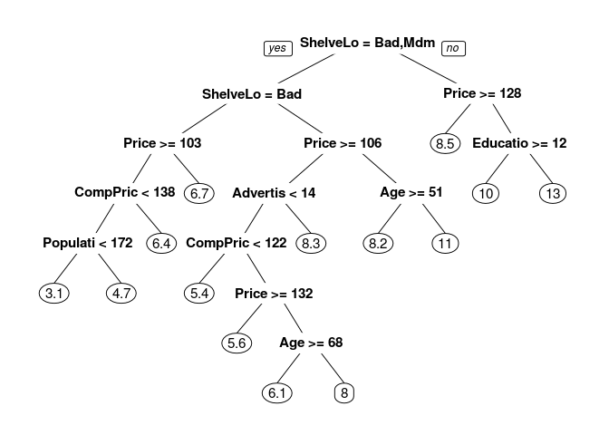

Homework 4: Bags, Forests, Boosts, oh my
================
Yao Liu
3/1/2019

Problem 1
---------

Problem 7 from Chapter 8 in the text. To be specific, please use a sequence of `ntree` from 25 to 500 in steps of 25 and `mtry` from 3 to 9 for by 1.

In the lab, we applied random forests to the Boston data using mtry=6 and using ntree=25 and ntree=500. Create a plot displaying the test error resulting from random forests on this data set for a more comprehensive range of values for mtry and ntree. You can model your plot after Figure 8.10. Describe the results obtained \#\# Answer1 v1.0

set.seed(10086) library(doMC) registerDoMC(cores = 4) df &lt;- tbl\_df(Boston) attach(Boston) inTraining &lt;- createDataPartition(medv, p = .5, list = F ) training &lt;- df\[inTraining, \] testing &lt;- df\[-inTraining, \]

boston\_frame &lt;- data\_frame(ntree = rep(seq(25,500,by=25),each = 7), mtry = rep(seq(3,9),20), mse = rep(NA, length(ntree))

) rp &lt;- rep(seq(25,500,by=25)) for (i in 1:length(rp)) { boston\_rf &lt;- train(medv ~ ., data = training, method = "rf", ntree = rp\[i\], tuneGrid = data.frame(mtry = 3:9)) for(n in 1:7){ boston\_frame\[(i-1)\*7+n,'mse'\] &lt;- boston\_rf*r**e**s**u**l**t**s*RMSE\[n\] } } test\_preds &lt;- predict(boston\_rf, newdata = testing) boston\_frame\[i,'mse'\] &lt;- mean((test\_preds - testing$medv)^2)

p &lt;- ggplot(data = boston\_frame, aes(x=ntree, y=mse, group = mtry, col = as.factor(mtry))) p + geom\_line()+ geom\_point()+ xlab("Number of Trees") + ylab("Training error")+ scale\_color\_brewer() theme\_bw()

From the line graph above, it's clear that when the ntree = 450, the rmse is the smallest; when the ntree = 175, the rmse is the second to the second smallest.

Answer1 v2.0
------------

``` r
library(doMC)
```

    ## Loading required package: iterators

``` r
registerDoMC(cores = 4)
set.seed(10086)
df <- tbl_df(Boston)
attach(Boston)
for (k in 1:20){
  inTraining <- createDataPartition(df$medv, p = .75, list = F)
  training <- df[inTraining, ]
  testing <- df[-inTraining, ]
  mtry <- c(3:9)
  ntree <- seq(25, 500, len = 20)
  results <- tibble(trial = rep(NA, 140),
  mtry = rep(NA, 140),
  ntree = rep(NA, 140),
  mse = rep(NA, 140)) 
  for(i in 1:7){
    cat(sprintf('Trial: %s, mtry: %s --- %s\n', k, mtry[i], Sys.time()))
    for(j in 1:20){ 
      boston_rf2 <- randomForest(medv ~ .,
                               data = training,
                               mtry = mtry[i],
                               ntree = ntree[j])
      mse <- mean((predict( boston_rf2, newdata = testing) - testing$medv)^2)
      results[(i-1)*20 + j, ] <- c(k, mtry[i], ntree[j], mse)
    }
  }
  if(exists("results_total")){
  results_total <- bind_rows(results_total, results)
  }
  else(
  results_total <- results
  )
}
```

    ## Trial: 1, mtry: 3 --- 2019-03-09 18:14:55
    ## Trial: 1, mtry: 4 --- 2019-03-09 18:15:00
    ## Trial: 1, mtry: 5 --- 2019-03-09 18:15:05
    ## Trial: 1, mtry: 6 --- 2019-03-09 18:15:12
    ## Trial: 1, mtry: 7 --- 2019-03-09 18:15:19
    ## Trial: 1, mtry: 8 --- 2019-03-09 18:15:28
    ## Trial: 1, mtry: 9 --- 2019-03-09 18:15:37
    ## Trial: 2, mtry: 3 --- 2019-03-09 18:15:47
    ## Trial: 2, mtry: 4 --- 2019-03-09 18:15:52
    ## Trial: 2, mtry: 5 --- 2019-03-09 18:15:58
    ## Trial: 2, mtry: 6 --- 2019-03-09 18:16:04
    ## Trial: 2, mtry: 7 --- 2019-03-09 18:16:12
    ## Trial: 2, mtry: 8 --- 2019-03-09 18:16:20
    ## Trial: 2, mtry: 9 --- 2019-03-09 18:16:30
    ## Trial: 3, mtry: 3 --- 2019-03-09 18:16:40
    ## Trial: 3, mtry: 4 --- 2019-03-09 18:16:45
    ## Trial: 3, mtry: 5 --- 2019-03-09 18:16:51
    ## Trial: 3, mtry: 6 --- 2019-03-09 18:16:57
    ## Trial: 3, mtry: 7 --- 2019-03-09 18:17:04
    ## Trial: 3, mtry: 8 --- 2019-03-09 18:17:13
    ## Trial: 3, mtry: 9 --- 2019-03-09 18:17:22
    ## Trial: 4, mtry: 3 --- 2019-03-09 18:17:32
    ## Trial: 4, mtry: 4 --- 2019-03-09 18:17:37
    ## Trial: 4, mtry: 5 --- 2019-03-09 18:17:43
    ## Trial: 4, mtry: 6 --- 2019-03-09 18:17:49
    ## Trial: 4, mtry: 7 --- 2019-03-09 18:17:57
    ## Trial: 4, mtry: 8 --- 2019-03-09 18:18:06
    ## Trial: 4, mtry: 9 --- 2019-03-09 18:18:15
    ## Trial: 5, mtry: 3 --- 2019-03-09 18:18:26
    ## Trial: 5, mtry: 4 --- 2019-03-09 18:18:30
    ## Trial: 5, mtry: 5 --- 2019-03-09 18:18:35
    ## Trial: 5, mtry: 6 --- 2019-03-09 18:18:42
    ## Trial: 5, mtry: 7 --- 2019-03-09 18:18:49
    ## Trial: 5, mtry: 8 --- 2019-03-09 18:18:58
    ## Trial: 5, mtry: 9 --- 2019-03-09 18:19:07
    ## Trial: 6, mtry: 3 --- 2019-03-09 18:19:17
    ## Trial: 6, mtry: 4 --- 2019-03-09 18:19:22
    ## Trial: 6, mtry: 5 --- 2019-03-09 18:19:27
    ## Trial: 6, mtry: 6 --- 2019-03-09 18:19:34
    ## Trial: 6, mtry: 7 --- 2019-03-09 18:19:42
    ## Trial: 6, mtry: 8 --- 2019-03-09 18:19:50
    ## Trial: 6, mtry: 9 --- 2019-03-09 18:19:59
    ## Trial: 7, mtry: 3 --- 2019-03-09 18:20:10
    ## Trial: 7, mtry: 4 --- 2019-03-09 18:20:14
    ## Trial: 7, mtry: 5 --- 2019-03-09 18:20:20
    ## Trial: 7, mtry: 6 --- 2019-03-09 18:20:27
    ## Trial: 7, mtry: 7 --- 2019-03-09 18:20:34
    ## Trial: 7, mtry: 8 --- 2019-03-09 18:20:42
    ## Trial: 7, mtry: 9 --- 2019-03-09 18:20:52
    ## Trial: 8, mtry: 3 --- 2019-03-09 18:21:02
    ## Trial: 8, mtry: 4 --- 2019-03-09 18:21:06
    ## Trial: 8, mtry: 5 --- 2019-03-09 18:21:12
    ## Trial: 8, mtry: 6 --- 2019-03-09 18:21:19
    ## Trial: 8, mtry: 7 --- 2019-03-09 18:21:26
    ## Trial: 8, mtry: 8 --- 2019-03-09 18:21:35
    ## Trial: 8, mtry: 9 --- 2019-03-09 18:21:44
    ## Trial: 9, mtry: 3 --- 2019-03-09 18:21:54
    ## Trial: 9, mtry: 4 --- 2019-03-09 18:21:59
    ## Trial: 9, mtry: 5 --- 2019-03-09 18:22:05
    ## Trial: 9, mtry: 6 --- 2019-03-09 18:22:11
    ## Trial: 9, mtry: 7 --- 2019-03-09 18:22:18
    ## Trial: 9, mtry: 8 --- 2019-03-09 18:22:27
    ## Trial: 9, mtry: 9 --- 2019-03-09 18:22:36
    ## Trial: 10, mtry: 3 --- 2019-03-09 18:22:46
    ## Trial: 10, mtry: 4 --- 2019-03-09 18:22:51
    ## Trial: 10, mtry: 5 --- 2019-03-09 18:22:57
    ## Trial: 10, mtry: 6 --- 2019-03-09 18:23:04
    ## Trial: 10, mtry: 7 --- 2019-03-09 18:23:11
    ## Trial: 10, mtry: 8 --- 2019-03-09 18:23:19
    ## Trial: 10, mtry: 9 --- 2019-03-09 18:23:29
    ## Trial: 11, mtry: 3 --- 2019-03-09 18:23:39
    ## Trial: 11, mtry: 4 --- 2019-03-09 18:23:44
    ## Trial: 11, mtry: 5 --- 2019-03-09 18:23:49
    ## Trial: 11, mtry: 6 --- 2019-03-09 18:23:56
    ## Trial: 11, mtry: 7 --- 2019-03-09 18:24:03
    ## Trial: 11, mtry: 8 --- 2019-03-09 18:24:11
    ## Trial: 11, mtry: 9 --- 2019-03-09 18:24:21
    ## Trial: 12, mtry: 3 --- 2019-03-09 18:24:31
    ## Trial: 12, mtry: 4 --- 2019-03-09 18:24:35
    ## Trial: 12, mtry: 5 --- 2019-03-09 18:24:41
    ## Trial: 12, mtry: 6 --- 2019-03-09 18:24:47
    ## Trial: 12, mtry: 7 --- 2019-03-09 18:24:55
    ## Trial: 12, mtry: 8 --- 2019-03-09 18:25:03
    ## Trial: 12, mtry: 9 --- 2019-03-09 18:25:12
    ## Trial: 13, mtry: 3 --- 2019-03-09 18:25:23
    ## Trial: 13, mtry: 4 --- 2019-03-09 18:25:27
    ## Trial: 13, mtry: 5 --- 2019-03-09 18:25:33
    ## Trial: 13, mtry: 6 --- 2019-03-09 18:25:39
    ## Trial: 13, mtry: 7 --- 2019-03-09 18:25:47
    ## Trial: 13, mtry: 8 --- 2019-03-09 18:25:55
    ## Trial: 13, mtry: 9 --- 2019-03-09 18:26:05
    ## Trial: 14, mtry: 3 --- 2019-03-09 18:26:15
    ## Trial: 14, mtry: 4 --- 2019-03-09 18:26:20
    ## Trial: 14, mtry: 5 --- 2019-03-09 18:26:26
    ## Trial: 14, mtry: 6 --- 2019-03-09 18:26:32
    ## Trial: 14, mtry: 7 --- 2019-03-09 18:26:40
    ## Trial: 14, mtry: 8 --- 2019-03-09 18:26:48
    ## Trial: 14, mtry: 9 --- 2019-03-09 18:26:57
    ## Trial: 15, mtry: 3 --- 2019-03-09 18:27:08
    ## Trial: 15, mtry: 4 --- 2019-03-09 18:27:12
    ## Trial: 15, mtry: 5 --- 2019-03-09 18:27:17
    ## Trial: 15, mtry: 6 --- 2019-03-09 18:27:24
    ## Trial: 15, mtry: 7 --- 2019-03-09 18:27:32
    ## Trial: 15, mtry: 8 --- 2019-03-09 18:27:40
    ## Trial: 15, mtry: 9 --- 2019-03-09 18:27:49
    ## Trial: 16, mtry: 3 --- 2019-03-09 18:27:59
    ## Trial: 16, mtry: 4 --- 2019-03-09 18:28:03
    ## Trial: 16, mtry: 5 --- 2019-03-09 18:28:09
    ## Trial: 16, mtry: 6 --- 2019-03-09 18:28:16
    ## Trial: 16, mtry: 7 --- 2019-03-09 18:28:23
    ## Trial: 16, mtry: 8 --- 2019-03-09 18:28:31
    ## Trial: 16, mtry: 9 --- 2019-03-09 18:28:41
    ## Trial: 17, mtry: 3 --- 2019-03-09 18:28:51
    ## Trial: 17, mtry: 4 --- 2019-03-09 18:28:56
    ## Trial: 17, mtry: 5 --- 2019-03-09 18:29:02
    ## Trial: 17, mtry: 6 --- 2019-03-09 18:29:08
    ## Trial: 17, mtry: 7 --- 2019-03-09 18:29:16
    ## Trial: 17, mtry: 8 --- 2019-03-09 18:29:24
    ## Trial: 17, mtry: 9 --- 2019-03-09 18:29:33
    ## Trial: 18, mtry: 3 --- 2019-03-09 18:29:43
    ## Trial: 18, mtry: 4 --- 2019-03-09 18:29:48
    ## Trial: 18, mtry: 5 --- 2019-03-09 18:29:54
    ## Trial: 18, mtry: 6 --- 2019-03-09 18:30:00
    ## Trial: 18, mtry: 7 --- 2019-03-09 18:30:08
    ## Trial: 18, mtry: 8 --- 2019-03-09 18:30:16
    ## Trial: 18, mtry: 9 --- 2019-03-09 18:30:26
    ## Trial: 19, mtry: 3 --- 2019-03-09 18:30:36
    ## Trial: 19, mtry: 4 --- 2019-03-09 18:30:41
    ## Trial: 19, mtry: 5 --- 2019-03-09 18:30:46
    ## Trial: 19, mtry: 6 --- 2019-03-09 18:30:53
    ## Trial: 19, mtry: 7 --- 2019-03-09 18:31:00
    ## Trial: 19, mtry: 8 --- 2019-03-09 18:31:09
    ## Trial: 19, mtry: 9 --- 2019-03-09 18:31:18
    ## Trial: 20, mtry: 3 --- 2019-03-09 18:31:28
    ## Trial: 20, mtry: 4 --- 2019-03-09 18:31:33
    ## Trial: 20, mtry: 5 --- 2019-03-09 18:31:38
    ## Trial: 20, mtry: 6 --- 2019-03-09 18:31:45
    ## Trial: 20, mtry: 7 --- 2019-03-09 18:31:52
    ## Trial: 20, mtry: 8 --- 2019-03-09 18:32:01
    ## Trial: 20, mtry: 9 --- 2019-03-09 18:32:10

``` r
p <- ggplot(data = results, 
            aes(x = ntree, y = mse, group = mtry, col = mtry))
p + geom_line()+
  geom_point()+
  xlab("Number of Trees") + ylab("Testing Error")+
  scale_color_gradient2("mtry")
```


``` r
  theme_bw()
```

    ## List of 59
    ##  $ line                 :List of 6
    ##   ..$ colour       : chr "black"
    ##   ..$ size         : num 0.5
    ##   ..$ linetype     : num 1
    ##   ..$ lineend      : chr "butt"
    ##   ..$ arrow        : logi FALSE
    ##   ..$ inherit.blank: logi TRUE
    ##   ..- attr(*, "class")= chr [1:2] "element_line" "element"
    ##  $ rect                 :List of 5
    ##   ..$ fill         : chr "white"
    ##   ..$ colour       : chr "black"
    ##   ..$ size         : num 0.5
    ##   ..$ linetype     : num 1
    ##   ..$ inherit.blank: logi TRUE
    ##   ..- attr(*, "class")= chr [1:2] "element_rect" "element"
    ##  $ text                 :List of 11
    ##   ..$ family       : chr ""
    ##   ..$ face         : chr "plain"
    ##   ..$ colour       : chr "black"
    ##   ..$ size         : num 11
    ##   ..$ hjust        : num 0.5
    ##   ..$ vjust        : num 0.5
    ##   ..$ angle        : num 0
    ##   ..$ lineheight   : num 0.9
    ##   ..$ margin       : 'margin' num [1:4] 0pt 0pt 0pt 0pt
    ##   .. ..- attr(*, "valid.unit")= int 8
    ##   .. ..- attr(*, "unit")= chr "pt"
    ##   ..$ debug        : logi FALSE
    ##   ..$ inherit.blank: logi TRUE
    ##   ..- attr(*, "class")= chr [1:2] "element_text" "element"
    ##  $ axis.title.x         :List of 11
    ##   ..$ family       : NULL
    ##   ..$ face         : NULL
    ##   ..$ colour       : NULL
    ##   ..$ size         : NULL
    ##   ..$ hjust        : NULL
    ##   ..$ vjust        : num 1
    ##   ..$ angle        : NULL
    ##   ..$ lineheight   : NULL
    ##   ..$ margin       : 'margin' num [1:4] 2.75pt 0pt 0pt 0pt
    ##   .. ..- attr(*, "valid.unit")= int 8
    ##   .. ..- attr(*, "unit")= chr "pt"
    ##   ..$ debug        : NULL
    ##   ..$ inherit.blank: logi TRUE
    ##   ..- attr(*, "class")= chr [1:2] "element_text" "element"
    ##  $ axis.title.x.top     :List of 11
    ##   ..$ family       : NULL
    ##   ..$ face         : NULL
    ##   ..$ colour       : NULL
    ##   ..$ size         : NULL
    ##   ..$ hjust        : NULL
    ##   ..$ vjust        : num 0
    ##   ..$ angle        : NULL
    ##   ..$ lineheight   : NULL
    ##   ..$ margin       : 'margin' num [1:4] 0pt 0pt 2.75pt 0pt
    ##   .. ..- attr(*, "valid.unit")= int 8
    ##   .. ..- attr(*, "unit")= chr "pt"
    ##   ..$ debug        : NULL
    ##   ..$ inherit.blank: logi TRUE
    ##   ..- attr(*, "class")= chr [1:2] "element_text" "element"
    ##  $ axis.title.y         :List of 11
    ##   ..$ family       : NULL
    ##   ..$ face         : NULL
    ##   ..$ colour       : NULL
    ##   ..$ size         : NULL
    ##   ..$ hjust        : NULL
    ##   ..$ vjust        : num 1
    ##   ..$ angle        : num 90
    ##   ..$ lineheight   : NULL
    ##   ..$ margin       : 'margin' num [1:4] 0pt 2.75pt 0pt 0pt
    ##   .. ..- attr(*, "valid.unit")= int 8
    ##   .. ..- attr(*, "unit")= chr "pt"
    ##   ..$ debug        : NULL
    ##   ..$ inherit.blank: logi TRUE
    ##   ..- attr(*, "class")= chr [1:2] "element_text" "element"
    ##  $ axis.title.y.right   :List of 11
    ##   ..$ family       : NULL
    ##   ..$ face         : NULL
    ##   ..$ colour       : NULL
    ##   ..$ size         : NULL
    ##   ..$ hjust        : NULL
    ##   ..$ vjust        : num 0
    ##   ..$ angle        : num -90
    ##   ..$ lineheight   : NULL
    ##   ..$ margin       : 'margin' num [1:4] 0pt 0pt 0pt 2.75pt
    ##   .. ..- attr(*, "valid.unit")= int 8
    ##   .. ..- attr(*, "unit")= chr "pt"
    ##   ..$ debug        : NULL
    ##   ..$ inherit.blank: logi TRUE
    ##   ..- attr(*, "class")= chr [1:2] "element_text" "element"
    ##  $ axis.text            :List of 11
    ##   ..$ family       : NULL
    ##   ..$ face         : NULL
    ##   ..$ colour       : chr "grey30"
    ##   ..$ size         : 'rel' num 0.8
    ##   ..$ hjust        : NULL
    ##   ..$ vjust        : NULL
    ##   ..$ angle        : NULL
    ##   ..$ lineheight   : NULL
    ##   ..$ margin       : NULL
    ##   ..$ debug        : NULL
    ##   ..$ inherit.blank: logi TRUE
    ##   ..- attr(*, "class")= chr [1:2] "element_text" "element"
    ##  $ axis.text.x          :List of 11
    ##   ..$ family       : NULL
    ##   ..$ face         : NULL
    ##   ..$ colour       : NULL
    ##   ..$ size         : NULL
    ##   ..$ hjust        : NULL
    ##   ..$ vjust        : num 1
    ##   ..$ angle        : NULL
    ##   ..$ lineheight   : NULL
    ##   ..$ margin       : 'margin' num [1:4] 2.2pt 0pt 0pt 0pt
    ##   .. ..- attr(*, "valid.unit")= int 8
    ##   .. ..- attr(*, "unit")= chr "pt"
    ##   ..$ debug        : NULL
    ##   ..$ inherit.blank: logi TRUE
    ##   ..- attr(*, "class")= chr [1:2] "element_text" "element"
    ##  $ axis.text.x.top      :List of 11
    ##   ..$ family       : NULL
    ##   ..$ face         : NULL
    ##   ..$ colour       : NULL
    ##   ..$ size         : NULL
    ##   ..$ hjust        : NULL
    ##   ..$ vjust        : num 0
    ##   ..$ angle        : NULL
    ##   ..$ lineheight   : NULL
    ##   ..$ margin       : 'margin' num [1:4] 0pt 0pt 2.2pt 0pt
    ##   .. ..- attr(*, "valid.unit")= int 8
    ##   .. ..- attr(*, "unit")= chr "pt"
    ##   ..$ debug        : NULL
    ##   ..$ inherit.blank: logi TRUE
    ##   ..- attr(*, "class")= chr [1:2] "element_text" "element"
    ##  $ axis.text.y          :List of 11
    ##   ..$ family       : NULL
    ##   ..$ face         : NULL
    ##   ..$ colour       : NULL
    ##   ..$ size         : NULL
    ##   ..$ hjust        : num 1
    ##   ..$ vjust        : NULL
    ##   ..$ angle        : NULL
    ##   ..$ lineheight   : NULL
    ##   ..$ margin       : 'margin' num [1:4] 0pt 2.2pt 0pt 0pt
    ##   .. ..- attr(*, "valid.unit")= int 8
    ##   .. ..- attr(*, "unit")= chr "pt"
    ##   ..$ debug        : NULL
    ##   ..$ inherit.blank: logi TRUE
    ##   ..- attr(*, "class")= chr [1:2] "element_text" "element"
    ##  $ axis.text.y.right    :List of 11
    ##   ..$ family       : NULL
    ##   ..$ face         : NULL
    ##   ..$ colour       : NULL
    ##   ..$ size         : NULL
    ##   ..$ hjust        : num 0
    ##   ..$ vjust        : NULL
    ##   ..$ angle        : NULL
    ##   ..$ lineheight   : NULL
    ##   ..$ margin       : 'margin' num [1:4] 0pt 0pt 0pt 2.2pt
    ##   .. ..- attr(*, "valid.unit")= int 8
    ##   .. ..- attr(*, "unit")= chr "pt"
    ##   ..$ debug        : NULL
    ##   ..$ inherit.blank: logi TRUE
    ##   ..- attr(*, "class")= chr [1:2] "element_text" "element"
    ##  $ axis.ticks           :List of 6
    ##   ..$ colour       : chr "grey20"
    ##   ..$ size         : NULL
    ##   ..$ linetype     : NULL
    ##   ..$ lineend      : NULL
    ##   ..$ arrow        : logi FALSE
    ##   ..$ inherit.blank: logi TRUE
    ##   ..- attr(*, "class")= chr [1:2] "element_line" "element"
    ##  $ axis.ticks.length    : 'unit' num 2.75pt
    ##   ..- attr(*, "valid.unit")= int 8
    ##   ..- attr(*, "unit")= chr "pt"
    ##  $ axis.line            : list()
    ##   ..- attr(*, "class")= chr [1:2] "element_blank" "element"
    ##  $ axis.line.x          : NULL
    ##  $ axis.line.y          : NULL
    ##  $ legend.background    :List of 5
    ##   ..$ fill         : NULL
    ##   ..$ colour       : logi NA
    ##   ..$ size         : NULL
    ##   ..$ linetype     : NULL
    ##   ..$ inherit.blank: logi TRUE
    ##   ..- attr(*, "class")= chr [1:2] "element_rect" "element"
    ##  $ legend.margin        : 'margin' num [1:4] 5.5pt 5.5pt 5.5pt 5.5pt
    ##   ..- attr(*, "valid.unit")= int 8
    ##   ..- attr(*, "unit")= chr "pt"
    ##  $ legend.spacing       : 'unit' num 11pt
    ##   ..- attr(*, "valid.unit")= int 8
    ##   ..- attr(*, "unit")= chr "pt"
    ##  $ legend.spacing.x     : NULL
    ##  $ legend.spacing.y     : NULL
    ##  $ legend.key           :List of 5
    ##   ..$ fill         : chr "white"
    ##   ..$ colour       : logi NA
    ##   ..$ size         : NULL
    ##   ..$ linetype     : NULL
    ##   ..$ inherit.blank: logi TRUE
    ##   ..- attr(*, "class")= chr [1:2] "element_rect" "element"
    ##  $ legend.key.size      : 'unit' num 1.2lines
    ##   ..- attr(*, "valid.unit")= int 3
    ##   ..- attr(*, "unit")= chr "lines"
    ##  $ legend.key.height    : NULL
    ##  $ legend.key.width     : NULL
    ##  $ legend.text          :List of 11
    ##   ..$ family       : NULL
    ##   ..$ face         : NULL
    ##   ..$ colour       : NULL
    ##   ..$ size         : 'rel' num 0.8
    ##   ..$ hjust        : NULL
    ##   ..$ vjust        : NULL
    ##   ..$ angle        : NULL
    ##   ..$ lineheight   : NULL
    ##   ..$ margin       : NULL
    ##   ..$ debug        : NULL
    ##   ..$ inherit.blank: logi TRUE
    ##   ..- attr(*, "class")= chr [1:2] "element_text" "element"
    ##  $ legend.text.align    : NULL
    ##  $ legend.title         :List of 11
    ##   ..$ family       : NULL
    ##   ..$ face         : NULL
    ##   ..$ colour       : NULL
    ##   ..$ size         : NULL
    ##   ..$ hjust        : num 0
    ##   ..$ vjust        : NULL
    ##   ..$ angle        : NULL
    ##   ..$ lineheight   : NULL
    ##   ..$ margin       : NULL
    ##   ..$ debug        : NULL
    ##   ..$ inherit.blank: logi TRUE
    ##   ..- attr(*, "class")= chr [1:2] "element_text" "element"
    ##  $ legend.title.align   : NULL
    ##  $ legend.position      : chr "right"
    ##  $ legend.direction     : NULL
    ##  $ legend.justification : chr "center"
    ##  $ legend.box           : NULL
    ##  $ legend.box.margin    : 'margin' num [1:4] 0cm 0cm 0cm 0cm
    ##   ..- attr(*, "valid.unit")= int 1
    ##   ..- attr(*, "unit")= chr "cm"
    ##  $ legend.box.background: list()
    ##   ..- attr(*, "class")= chr [1:2] "element_blank" "element"
    ##  $ legend.box.spacing   : 'unit' num 11pt
    ##   ..- attr(*, "valid.unit")= int 8
    ##   ..- attr(*, "unit")= chr "pt"
    ##  $ panel.background     :List of 5
    ##   ..$ fill         : chr "white"
    ##   ..$ colour       : logi NA
    ##   ..$ size         : NULL
    ##   ..$ linetype     : NULL
    ##   ..$ inherit.blank: logi TRUE
    ##   ..- attr(*, "class")= chr [1:2] "element_rect" "element"
    ##  $ panel.border         :List of 5
    ##   ..$ fill         : logi NA
    ##   ..$ colour       : chr "grey20"
    ##   ..$ size         : NULL
    ##   ..$ linetype     : NULL
    ##   ..$ inherit.blank: logi TRUE
    ##   ..- attr(*, "class")= chr [1:2] "element_rect" "element"
    ##  $ panel.spacing        : 'unit' num 5.5pt
    ##   ..- attr(*, "valid.unit")= int 8
    ##   ..- attr(*, "unit")= chr "pt"
    ##  $ panel.spacing.x      : NULL
    ##  $ panel.spacing.y      : NULL
    ##  $ panel.grid           :List of 6
    ##   ..$ colour       : chr "grey92"
    ##   ..$ size         : NULL
    ##   ..$ linetype     : NULL
    ##   ..$ lineend      : NULL
    ##   ..$ arrow        : logi FALSE
    ##   ..$ inherit.blank: logi TRUE
    ##   ..- attr(*, "class")= chr [1:2] "element_line" "element"
    ##  $ panel.grid.minor     :List of 6
    ##   ..$ colour       : NULL
    ##   ..$ size         : 'rel' num 0.5
    ##   ..$ linetype     : NULL
    ##   ..$ lineend      : NULL
    ##   ..$ arrow        : logi FALSE
    ##   ..$ inherit.blank: logi TRUE
    ##   ..- attr(*, "class")= chr [1:2] "element_line" "element"
    ##  $ panel.ontop          : logi FALSE
    ##  $ plot.background      :List of 5
    ##   ..$ fill         : NULL
    ##   ..$ colour       : chr "white"
    ##   ..$ size         : NULL
    ##   ..$ linetype     : NULL
    ##   ..$ inherit.blank: logi TRUE
    ##   ..- attr(*, "class")= chr [1:2] "element_rect" "element"
    ##  $ plot.title           :List of 11
    ##   ..$ family       : NULL
    ##   ..$ face         : NULL
    ##   ..$ colour       : NULL
    ##   ..$ size         : 'rel' num 1.2
    ##   ..$ hjust        : num 0
    ##   ..$ vjust        : num 1
    ##   ..$ angle        : NULL
    ##   ..$ lineheight   : NULL
    ##   ..$ margin       : 'margin' num [1:4] 0pt 0pt 5.5pt 0pt
    ##   .. ..- attr(*, "valid.unit")= int 8
    ##   .. ..- attr(*, "unit")= chr "pt"
    ##   ..$ debug        : NULL
    ##   ..$ inherit.blank: logi TRUE
    ##   ..- attr(*, "class")= chr [1:2] "element_text" "element"
    ##  $ plot.subtitle        :List of 11
    ##   ..$ family       : NULL
    ##   ..$ face         : NULL
    ##   ..$ colour       : NULL
    ##   ..$ size         : NULL
    ##   ..$ hjust        : num 0
    ##   ..$ vjust        : num 1
    ##   ..$ angle        : NULL
    ##   ..$ lineheight   : NULL
    ##   ..$ margin       : 'margin' num [1:4] 0pt 0pt 5.5pt 0pt
    ##   .. ..- attr(*, "valid.unit")= int 8
    ##   .. ..- attr(*, "unit")= chr "pt"
    ##   ..$ debug        : NULL
    ##   ..$ inherit.blank: logi TRUE
    ##   ..- attr(*, "class")= chr [1:2] "element_text" "element"
    ##  $ plot.caption         :List of 11
    ##   ..$ family       : NULL
    ##   ..$ face         : NULL
    ##   ..$ colour       : NULL
    ##   ..$ size         : 'rel' num 0.8
    ##   ..$ hjust        : num 1
    ##   ..$ vjust        : num 1
    ##   ..$ angle        : NULL
    ##   ..$ lineheight   : NULL
    ##   ..$ margin       : 'margin' num [1:4] 5.5pt 0pt 0pt 0pt
    ##   .. ..- attr(*, "valid.unit")= int 8
    ##   .. ..- attr(*, "unit")= chr "pt"
    ##   ..$ debug        : NULL
    ##   ..$ inherit.blank: logi TRUE
    ##   ..- attr(*, "class")= chr [1:2] "element_text" "element"
    ##  $ plot.tag             :List of 11
    ##   ..$ family       : NULL
    ##   ..$ face         : NULL
    ##   ..$ colour       : NULL
    ##   ..$ size         : 'rel' num 1.2
    ##   ..$ hjust        : num 0.5
    ##   ..$ vjust        : num 0.5
    ##   ..$ angle        : NULL
    ##   ..$ lineheight   : NULL
    ##   ..$ margin       : NULL
    ##   ..$ debug        : NULL
    ##   ..$ inherit.blank: logi TRUE
    ##   ..- attr(*, "class")= chr [1:2] "element_text" "element"
    ##  $ plot.tag.position    : chr "topleft"
    ##  $ plot.margin          : 'margin' num [1:4] 5.5pt 5.5pt 5.5pt 5.5pt
    ##   ..- attr(*, "valid.unit")= int 8
    ##   ..- attr(*, "unit")= chr "pt"
    ##  $ strip.background     :List of 5
    ##   ..$ fill         : chr "grey85"
    ##   ..$ colour       : chr "grey20"
    ##   ..$ size         : NULL
    ##   ..$ linetype     : NULL
    ##   ..$ inherit.blank: logi TRUE
    ##   ..- attr(*, "class")= chr [1:2] "element_rect" "element"
    ##  $ strip.placement      : chr "inside"
    ##  $ strip.text           :List of 11
    ##   ..$ family       : NULL
    ##   ..$ face         : NULL
    ##   ..$ colour       : chr "grey10"
    ##   ..$ size         : 'rel' num 0.8
    ##   ..$ hjust        : NULL
    ##   ..$ vjust        : NULL
    ##   ..$ angle        : NULL
    ##   ..$ lineheight   : NULL
    ##   ..$ margin       : 'margin' num [1:4] 4.4pt 4.4pt 4.4pt 4.4pt
    ##   .. ..- attr(*, "valid.unit")= int 8
    ##   .. ..- attr(*, "unit")= chr "pt"
    ##   ..$ debug        : NULL
    ##   ..$ inherit.blank: logi TRUE
    ##   ..- attr(*, "class")= chr [1:2] "element_text" "element"
    ##  $ strip.text.x         : NULL
    ##  $ strip.text.y         :List of 11
    ##   ..$ family       : NULL
    ##   ..$ face         : NULL
    ##   ..$ colour       : NULL
    ##   ..$ size         : NULL
    ##   ..$ hjust        : NULL
    ##   ..$ vjust        : NULL
    ##   ..$ angle        : num -90
    ##   ..$ lineheight   : NULL
    ##   ..$ margin       : NULL
    ##   ..$ debug        : NULL
    ##   ..$ inherit.blank: logi TRUE
    ##   ..- attr(*, "class")= chr [1:2] "element_text" "element"
    ##  $ strip.switch.pad.grid: 'unit' num 2.75pt
    ##   ..- attr(*, "valid.unit")= int 8
    ##   ..- attr(*, "unit")= chr "pt"
    ##  $ strip.switch.pad.wrap: 'unit' num 2.75pt
    ##   ..- attr(*, "valid.unit")= int 8
    ##   ..- attr(*, "unit")= chr "pt"
    ##  - attr(*, "class")= chr [1:2] "theme" "gg"
    ##  - attr(*, "complete")= logi TRUE
    ##  - attr(*, "validate")= logi TRUE

Problem 2
---------

Problem 8 from Chapter 8 in the text. Set your seed with 9823 and split into train/test using 50% of your data in each split. In addition to parts (a) - (e), do the following:

1.  Fit a gradient-boosted tree to the training data and report the estimated test MSE.
2.  Fit a multiple regression model to the training data and report the estimated test MSE
3.  Summarize your results.

<!-- -->

1.  

``` r
set.seed(9823)
df <- tbl_df(Carseats)
attach(Carseats)
inTraining <- createDataPartition(Sales, p = .5, list = F )
training <- df[inTraining, ]
testing  <- df[-inTraining, ]
```

### regression tree

``` r
tree <- rpart::rpart(Sales ~ ., data = training)
prp(tree)
```



``` r
y_pred <- predict(tree, newdata = testing) 
mean((y_pred - testing$Sales)^2)
```

    ## [1] 4.484515

The test MSE is 4.4845

(c)Use cross-validation in order to determine the optimal level of tree complexity. Does pruning the tree improve the test MSE

``` r
set.seed(9832) 
fit_control <- trainControl(method = "repeatedcv",
                           number = 10, 
                           repeats = 10)           #specify the control parameter
cv_carseats_tree <- train(Sales ~ ., 
                        data = training,
                        method = "rpart2", 
                        trControl = fit_control,
                        tuneGrid = data.frame(maxdepth = 1:7))   
```

    ## Warning in nominalTrainWorkflow(x = x, y = y, wts = weights, info =
    ## trainInfo, : There were missing values in resampled performance measures.

``` r
plot(cv_carseats_tree)
```


``` r
cv_carseats_tree
```

    ## CART 
    ## 
    ## 201 samples
    ##  10 predictor
    ## 
    ## No pre-processing
    ## Resampling: Cross-Validated (10 fold, repeated 10 times) 
    ## Summary of sample sizes: 181, 181, 181, 181, 181, 181, ... 
    ## Resampling results across tuning parameters:
    ## 
    ##   maxdepth  RMSE      Rsquared   MAE     
    ##   1         2.387537  0.2608203  2.003045
    ##   2         2.338213  0.2956125  1.907874
    ##   3         2.219605  0.3633435  1.813009
    ##   4         2.256422  0.3521681  1.849433
    ##   5         2.286774  0.3443410  1.863675
    ##   6         2.289536  0.3516689  1.862701
    ##   7         2.281955  0.3764553  1.815238
    ## 
    ## RMSE was used to select the optimal model using the smallest value.
    ## The final value used for the model was maxdepth = 3.

The final value used for the model was maxdepth = 3.Predict the test set MSE using the tree from the CV training (maxdepth = 3)

``` r
test_preds <- predict(cv_carseats_tree, newdata = testing)   
carseats_test_df <- testing %>%
  mutate(y_hat = test_preds,
         sq_err = (y_hat - Sales)^2)
mean(carseats_test_df$sq_err)
```

    ## [1] 4.933184

The pruning tree improve the test MSE, from 5.29 to 4.93

### Bagging

1.  Use the bagging approach in order to analyze this data. What test MSE do you obtain? Use the importance() function to determine which variables are most important

``` r
set.seed(10086)
bag_carseats <- randomForest(Sales ~ ., data = training, mtry = 10, ntree = 100)  
bag_carseats
```

    ## 
    ## Call:
    ##  randomForest(formula = Sales ~ ., data = training, mtry = 10,      ntree = 100) 
    ##                Type of random forest: regression
    ##                      Number of trees: 100
    ## No. of variables tried at each split: 10
    ## 
    ##           Mean of squared residuals: 2.821473
    ##                     % Var explained: 62.02

``` r
test_preds <- predict(bag_carseats, newdata = testing)
carseats_test_df <- carseats_test_df %>%
  mutate(y_hat_carseats = test_preds,
         sq_err_bags = (y_hat_carseats - Sales)^2) 
mean(carseats_test_df$sq_err_bags) 
```

    ## [1] 2.998203

``` r
varImpPlot(bag_carseats, sort = TRUE, n.var = min(10, nrow(bag_carseats$importance)))
```

 ShelveLoc, Price, CompPrice, Income and Advertising are the top five most important variables.

### Random Forests

1.  Use random forests to analyze this data. What test MSE do you obtain? Use the importance() function to determine which vari-ables are most important. Describe the effect of m,thenumberof variables considered at each split, on the error rate obtained

``` r
rf_carseats <- randomForest(Sales ~ ., 
                          data = training,
                          mtry = 3)  #m=square root of p, we have a Test MSE of 3.3
test_preds <- predict(rf_carseats, newdata = testing)
carseats_test_df <- carseats_test_df %>%
  mutate(y_hat_rf = test_preds,
         sq_err_rf = (y_hat_rf - Sales)^2)
mean(carseats_test_df$sq_err_rf)
```

    ## [1] 3.52966

``` r
varImpPlot(rf_carseats, sort = TRUE, n.var = min(10, nrow(bag_carseats$importance)))
```

 The test MSE is 3.5582. ShelveLoc, Price, CompPrice, Advertising and Age are the top five most important variables.

### Gradient Boosting Regression

``` r
set.seed(9832)
grid <- expand.grid(interaction.depth = c(1, 3), 
                    n.trees = seq(0, 2000, by = 100),
                    shrinkage = c(.01, 0.001),
                    n.minobsinnode = 10)
trainControl <- trainControl(method = "cv", number = 5)     
gbm_carseats <- train(Sales ~ ., 
                    data = training, 
                    distribution = "gaussian", 
                    method = "gbm",                       #method for gradient boosted
                    trControl = trainControl, 
                    tuneGrid = grid,
                    verbose = FALSE) 
```

    ## Warning in nominalTrainWorkflow(x = x, y = y, wts = weights, info =
    ## trainInfo, : There were missing values in resampled performance measures.

``` r
gbm_carseats
```

    ## Stochastic Gradient Boosting 
    ## 
    ## 201 samples
    ##  10 predictor
    ## 
    ## No pre-processing
    ## Resampling: Cross-Validated (5 fold) 
    ## Summary of sample sizes: 161, 161, 161, 160, 161 
    ## Resampling results across tuning parameters:
    ## 
    ##   shrinkage  interaction.depth  n.trees  RMSE      Rsquared   MAE     
    ##   0.001      1                     0     2.725869        NaN  2.199618
    ##   0.001      1                   100     2.675471  0.2915180  2.163173
    ##   0.001      1                   200     2.633189  0.3045051  2.132086
    ##   0.001      1                   300     2.595306  0.3237036  2.105150
    ##   0.001      1                   400     2.560849  0.3440369  2.076936
    ##   0.001      1                   500     2.528893  0.3598858  2.050866
    ##   0.001      1                   600     2.499634  0.3702251  2.025782
    ##   0.001      1                   700     2.472555  0.3795631  2.002625
    ##   0.001      1                   800     2.447471  0.3906004  1.980831
    ##   0.001      1                   900     2.423500  0.3998188  1.959868
    ##   0.001      1                  1000     2.400745  0.4094528  1.939490
    ##   0.001      1                  1100     2.380305  0.4154763  1.921488
    ##   0.001      1                  1200     2.359017  0.4228183  1.903617
    ##   0.001      1                  1300     2.339810  0.4296395  1.886468
    ##   0.001      1                  1400     2.321149  0.4367307  1.870074
    ##   0.001      1                  1500     2.303289  0.4454710  1.854497
    ##   0.001      1                  1600     2.286159  0.4532564  1.839462
    ##   0.001      1                  1700     2.269068  0.4624627  1.824886
    ##   0.001      1                  1800     2.253429  0.4679322  1.811284
    ##   0.001      1                  1900     2.237820  0.4748938  1.798122
    ##   0.001      1                  2000     2.221811  0.4828409  1.784821
    ##   0.001      3                     0     2.725869        NaN  2.199618
    ##   0.001      3                   100     2.631849  0.4980600  2.124474
    ##   0.001      3                   200     2.551295  0.5155852  2.061538
    ##   0.001      3                   300     2.480722  0.5305253  2.006037
    ##   0.001      3                   400     2.416418  0.5478786  1.954822
    ##   0.001      3                   500     2.358381  0.5620224  1.907854
    ##   0.001      3                   600     2.305146  0.5762633  1.863854
    ##   0.001      3                   700     2.256288  0.5896737  1.823997
    ##   0.001      3                   800     2.209894  0.6010588  1.784776
    ##   0.001      3                   900     2.166949  0.6112102  1.748429
    ##   0.001      3                  1000     2.126405  0.6218199  1.713830
    ##   0.001      3                  1100     2.087800  0.6315688  1.681153
    ##   0.001      3                  1200     2.052740  0.6407028  1.651381
    ##   0.001      3                  1300     2.017793  0.6503408  1.621425
    ##   0.001      3                  1400     1.984903  0.6589702  1.593154
    ##   0.001      3                  1500     1.954851  0.6655748  1.568165
    ##   0.001      3                  1600     1.925292  0.6723493  1.542568
    ##   0.001      3                  1700     1.898323  0.6775071  1.519717
    ##   0.001      3                  1800     1.873246  0.6821047  1.498128
    ##   0.001      3                  1900     1.847913  0.6872421  1.476557
    ##   0.001      3                  2000     1.823795  0.6926046  1.455958
    ##   0.010      1                     0     2.725869        NaN  2.199618
    ##   0.010      1                   100     2.402064  0.4004539  1.941728
    ##   0.010      1                   200     2.214054  0.4886400  1.780653
    ##   0.010      1                   300     2.084109  0.5403486  1.666724
    ##   0.010      1                   400     1.966343  0.6001189  1.570753
    ##   0.010      1                   500     1.870182  0.6372899  1.492545
    ##   0.010      1                   600     1.779178  0.6679201  1.420219
    ##   0.010      1                   700     1.706900  0.6892659  1.362143
    ##   0.010      1                   800     1.647902  0.7039069  1.316006
    ##   0.010      1                   900     1.596725  0.7164083  1.277956
    ##   0.010      1                  1000     1.542258  0.7299058  1.235207
    ##   0.010      1                  1100     1.502638  0.7384536  1.205502
    ##   0.010      1                  1200     1.472012  0.7439900  1.180988
    ##   0.010      1                  1300     1.440595  0.7502816  1.155608
    ##   0.010      1                  1400     1.420187  0.7535378  1.140709
    ##   0.010      1                  1500     1.399542  0.7565733  1.124282
    ##   0.010      1                  1600     1.384038  0.7585328  1.112867
    ##   0.010      1                  1700     1.369940  0.7610875  1.103992
    ##   0.010      1                  1800     1.357970  0.7628073  1.093961
    ##   0.010      1                  1900     1.349404  0.7643484  1.088390
    ##   0.010      1                  2000     1.344205  0.7648903  1.083832
    ##   0.010      3                     0     2.725869        NaN  2.199618
    ##   0.010      3                   100     2.125495  0.6105341  1.713419
    ##   0.010      3                   200     1.815939  0.6935559  1.449901
    ##   0.010      3                   300     1.629323  0.7307950  1.295088
    ##   0.010      3                   400     1.518652  0.7460712  1.198861
    ##   0.010      3                   500     1.442156  0.7558984  1.143279
    ##   0.010      3                   600     1.395730  0.7626193  1.110194
    ##   0.010      3                   700     1.366779  0.7665086  1.087794
    ##   0.010      3                   800     1.347856  0.7690303  1.071939
    ##   0.010      3                   900     1.335457  0.7708256  1.060101
    ##   0.010      3                  1000     1.329008  0.7710520  1.055655
    ##   0.010      3                  1100     1.324112  0.7712746  1.051562
    ##   0.010      3                  1200     1.323396  0.7702318  1.049277
    ##   0.010      3                  1300     1.324654  0.7692914  1.050183
    ##   0.010      3                  1400     1.325371  0.7684681  1.051884
    ##   0.010      3                  1500     1.327586  0.7671397  1.053411
    ##   0.010      3                  1600     1.327277  0.7666716  1.054144
    ##   0.010      3                  1700     1.327320  0.7660556  1.056496
    ##   0.010      3                  1800     1.327789  0.7655703  1.059470
    ##   0.010      3                  1900     1.329284  0.7646286  1.060760
    ##   0.010      3                  2000     1.330407  0.7639757  1.060158
    ## 
    ## Tuning parameter 'n.minobsinnode' was held constant at a value of 10
    ## RMSE was used to select the optimal model using the smallest value.
    ## The final values used for the model were n.trees = 1200,
    ##  interaction.depth = 3, shrinkage = 0.01 and n.minobsinnode = 10.

``` r
test_preds <- predict(gbm_carseats, newdata = testing)
carseats_test_df <- carseats_test_df %>%
  mutate(y_hat_gbm = test_preds,
         sq_err_gbm = (y_hat_gbm - Sales)^2)
mean(carseats_test_df$sq_err_gbm)
```

    ## [1] 1.801192

The test MSE is 1.8019

### Multiple regression

``` r
multireg <- lm(Sales ~ . ,
                 data = training)   
test_preds <- predict(multireg, newdata = testing)
carseats_test_df <- carseats_test_df %>%
  mutate(y_hat_mul = test_preds,
         err_mul = (y_hat_mul - Sales)^2)
mean(carseats_test_df$err_mul)
```

    ## [1] 1.012709

The test MSE for multiple regression is 1.0127

### Summary

``` r
p <- dplyr::select(carseats_test_df, sq_err_rf, 
                   sq_err_bags, sq_err_gbm, err_mul) %>%
  gather(method, sq_err) %>%
  ggplot(aes(sq_err, fill = method))
```

    ## Warning: attributes are not identical across measure variables;
    ## they will be dropped

``` r
p + geom_density(alpha = .3) +
  scale_x_continuous("squared error", limits = c(0, 50)) +
  scale_fill_brewer(palette = "Dark2",
                    labels = c("RF", "Bags", "GB", "Multi-Regre")) 
```


